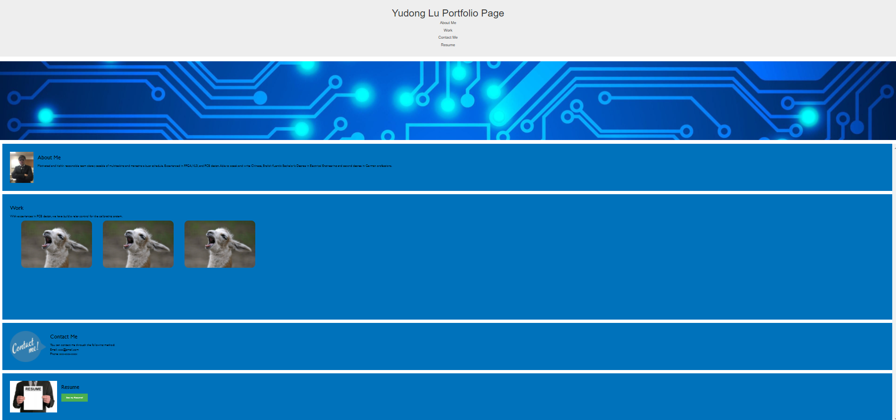

# 02 Advanced CSS: Portfolio


## User Story

```
AS AN employer
I WANT to view a potential employee's deployed portfolio of work samples
SO THAT I can review samples of their work and assess whether they're a good candidate for an open position
```


## Acceptance Criteria

Here are the critical requirements necessary to develop a portfolio that satisfies a typical hiring manager’s needs:

```
GIVEN I need to sample a potential employee's previous work
WHEN I load their portfolio
THEN I am presented with the developer's name, a recent photo or avatar, and links to sections about them, their work, and how to contact them
WHEN I click one of the links in the navigation
THEN the UI scrolls to the corresponding section
WHEN I click on the link to the section about their work
THEN the UI scrolls to a section with titled images of the developer's applications
WHEN I am presented with the developer's first application
THEN that application's image should be larger in size than the others
WHEN I click on the images of the applications
THEN I am taken to that deployed application
WHEN I resize the page or view the site on various screens and devices
THEN I am presented with a responsive layout that adapts to my viewport
```

## For this project

```
Here are some of the things I did for this project:

After the first project comments from the grader, I have changed the README file to add some more details of the project, along with some thoughts I had when working on this
First of all, I think one of the most challenge part of this project is the responsive viewport
What we learned during the class is to use the Media Queries to make it happen
But my tutor had introduced me another way, that is using the bootstrap libary to make it automatically adjust to the viewport
And that is what I did, in the very beginning, to call the bootstrap and use the script from the libary 
Next I add the avatar, links to section, and contact info
Since I don't have a showcase, I used three llama picture instead
And I also added the hover design so when hovering those image, it will become a size bigger
One thing I have not figured out is how to adjust the padding and background to make them also responsive to viewport
I will keep looking for alternative solution to make that happen
Or learn more about how to use bootstrap more effectivly


```

## Here is the screenshot: 

<p>
    
</p>
